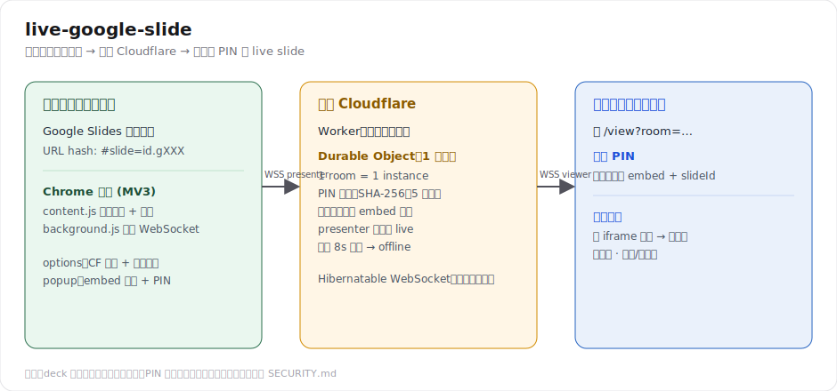

# live-google-slide

   



把你正在放映的 Google Slides，即時同步到任何一台裝置——跑在**你自己的 Cloudflare Worker** 上，用 **PIN** 控管誰能看。

主控端是一個 Chrome 外掛，讀 Google **原生放映**的當前頁（所以你照常用全螢幕、走動、用筆標註）；觀眾打開你的網址、輸入 PIN，就看到你即時翻到的那一頁。

```
[你的電腦]
  Google 原生放映 (…/present#slide=id.gXXX)
  Chrome 外掛: content script 讀 hash → background 推 slideId
        │  WSS  role=presenter (+控制密碼)
        ▼
[你的 Cloudflare]  Worker + Durable Object
  驗 PIN 後才把 embed 網址 + slideId 發給觀眾
        ▼
[任一台裝置]  https://你的網址/view?room=xxx → 輸 PIN → 看 live slide
```

一個 Durable Object = 一場簡報（一個 room）。主控端連著才「live」，斷線 8 秒後觀眾轉黑。

---

## 一、部署 Worker

需要 Node.js 與一個 Cloudflare 帳號。

```bash
npm install
npx wrangler login
npm run deploy           # 預設部署到 *.workers.dev
npm run secret           # 設定 PRESENT_KEY（主控端控制密碼）
```

要綁自訂網域（例如 `live.my-domain.com`）：先把該網域接進 Cloudflare，再到 `wrangler.toml` 取消 `routes` 註解、改成你的網域，重新 `npm run deploy`。

本機開發：把 `.dev.vars.example` 複製成 `.dev.vars`、填 `PRESENT_KEY`，然後 `npm run dev`。

## 二、安裝 Chrome 外掛（一次）

1. `chrome://extensions` → 開「開發人員模式」→「載入未封裝項目」→ 選 `extension/` 資料夾。
2. 點外掛 →「設定」→ 填你的 Worker 網址（含 `https://`）和 `PRESENT_KEY`，儲存。

## 三、每份簡報的流程

1. 該份簡報：`檔案 → 共用 → 發布到網路 → 嵌入`，複製 embed 網址。
2. 點外掛 popup：貼 embed 網址、設房間名、按「產生」給 PIN。
3. Google Slides 按**原生放映**。
4. 回 popup 按「開始直播」，把 PIN 報給聽眾。
5. 聽眾開 `https://你的網址/view?room=房間名` → 輸 PIN → 跟著你翻頁。
   觀眾端支援全螢幕（按鈕 / `f` / 雙擊）。

---

## 安全模型（請務必理解）

- `PRESENT_KEY`（控制密碼）= 決定**誰能當主控端**，存成 Cloudflare secret。
- `PIN` = 決定**誰能看**，每場可不同；以 SHA-256 雜湊存於 Durable Object，錯 5 次鎖定。
- 驗證一律在伺服器端（Durable Object）；deck 的 embed 網址要**驗 PIN 後才下發**，所以沒 PIN 的人連 Google 的網址都拿不到。

**天花板：** 為了讓 viewer 用 iframe 顯示，這份 deck 必須「發布到網路」＝公開。PIN 擋的是**進場**，擋不了**已進場的人**——一個輸對 PIN 的聽眾，他的瀏覽器終究要抓 Google 那份 public deck，他若打開 DevTools 就能拿到原始網址、之後繞過 PIN 重看或轉發。

如果需求是「deck 從頭到尾私有、沒有任何可繞的公開網址」，唯一作法是改成 deck 保持私有、由 Worker 端用 Slides API `pages.getThumbnail` 把當前頁算成圖片推給觀眾。本 repo 未包含該模式。

## 已知脆弱點

外掛靠解析放映 URL 的 `#slide=id.<objectId>`。Google 若改前端 hash 格式，`extension/content.js` 的正規式可能要跟著調——這是所有這類外掛共同的問題。

## 專案結構

```
live-google-slide/
├─ src/index.js          Worker + Durable Object（relay、PIN、live/offline）
├─ extension/            Chrome 外掛（MV3）
│  ├─ manifest.json
│  ├─ background.js      唯一持有對 CF 的 WebSocket（避開頁面 CSP）
│  ├─ content.js         讀放映當前頁 + 心跳保活
│  ├─ popup.* / options.*
├─ .github/workflows/   CI（PR dry-run）、Worker 部署、外掛發版
├─ CHANGELOG.md
├─ wrangler.toml
├─ .dev.vars.example     本機 secret 範本（複製成 .dev.vars）
└─ package.json
```

`src/index.js` 另含一個 `/present` 純網頁主控端，作為「不裝外掛」的後備（需在檔內手填 deck 常數）。日常用外掛即可。

## License

MIT — 見 [LICENSE](./LICENSE)。

## 自動化（GitHub Actions）

兩個 workflow 都在 push 到 `main` 時觸發——**PR merge 進 main 也算 push**，所以合併即生效。

| Workflow | 觸發 | 動作 |
| --- | --- | --- |
| `deploy-worker.yml` | 改到 `src/**`、`wrangler.toml`、`package.json` | `wrangler deploy` 部署 Worker |
| `release-extension.yml` | 改到 `extension/**` | 打包外掛 zip、自動 bump 版本、建立 GitHub Release |

兩者也都支援手動執行（Actions 分頁 → Run workflow）。

### 需要設定的 repo secrets

`Settings → Secrets and variables → Actions`：

- `CLOUDFLARE_API_TOKEN` — 在 Cloudflare 後台建立，套用「Edit Cloudflare Workers」範本。
- `CLOUDFLARE_ACCOUNT_ID` — 你的帳號 ID（Workers 總覽頁右側可見）。

`GITHUB_TOKEN` 由 Actions 自動提供，不用自己設。

### 版本怎麼算

外掛版本 = `manifest.json` 的 **major.minor** + 該次 **run 編號**當 patch（例如 `1.0.37`），每次發版自動遞增，**不會 commit 回 main**（避開分支保護與遞迴觸發）。要升 major/minor，手動改 `extension/manifest.json` 的前兩段即可。

> `PRESENT_KEY` 是執行期 secret，仍用 `wrangler secret put PRESENT_KEY` 設定，**不經過 CI**。

### Pull Request 檢查（不部署）

對 `main` 開 PR 會跑 `ci.yml`：用 `wrangler deploy --dry-run` 確認 Worker 能正常 bundle，並驗證外掛 `manifest.json` 是合法 JSON。純驗證、不會部署、不需 secret。

### CHANGELOG → Release 說明

把要寫進下次發版的條目放在 `CHANGELOG.md` 的 `## [Unreleased]` 底下。`release-extension.yml` 會擷取這一段當作 GitHub Release 的說明，後面再自動接上本次合併的 PR/commit 清單。

## 社群

- 參與貢獻：[CONTRIBUTING.md](./CONTRIBUTING.md)
- 行為準則：[CODE_OF_CONDUCT.md](./CODE_OF_CONDUCT.md)
- 安全政策與威脅模型：[SECURITY.md](./SECURITY.md)
- 變更記錄：[CHANGELOG.md](./CHANGELOG.md)
- 回報問題用 issue 範本；送 PR 會帶出 PR 範本。
